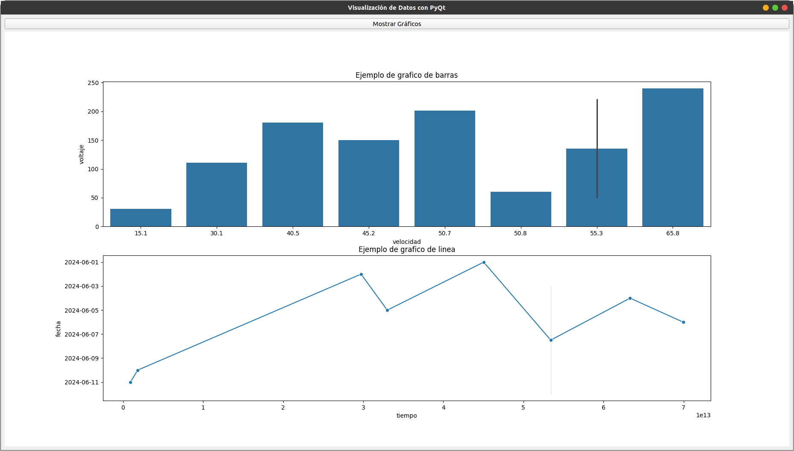

# Desafio YPF Eco - Programacion

En este repositorio subiremos todos los archivos que hagamos para poder tener un registro.

Los dos archivos subidos son dos ejemplos de como mostrar datos en una aplicacion y una pagina web, es simplemente para probar las librerias de python y ver si se muestran los datos extraidos de la **base de datos**. 

**Aclaracion**: Todos los datos y tablas mostradas son pruebas para entender y aprender el funcionamiento de estas librerias.

## Dash

Este genera una **pagina web** que actualiza los datos cada 10 segundos.

## QT Designer

Esta es una **aplicacion** que muestra los datos pero no se actualiza, hay que volver a abrir la aplicacion para ver los datos actualizados

En ambos casos utilizo una hay que cambiar el motor de la base de datos para que funciones en sus computadoras

### Integrantes:

Bautista Barbero  
Mateo Raviolo  
Carlos Vercellone
